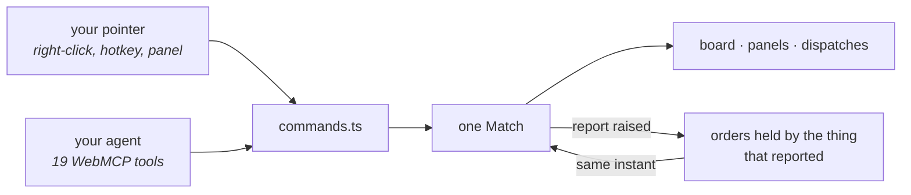

# Overloaded

**A real-time strategy game with a battlefield too wide for one person — so hand half of it to your agent.**

**[Play it](https://overloaded.fpahmad36.workers.dev)** · 19 WebMCP tools over the live match

Built for the WebMCP Challenge.


## The Problem

Strategy games are the one genre deliberately unfair to your attention. More is always happening
than one person can watch, and the skill being measured is triage — what you choose to lose.

The usual shape of an agent-on-a-page demo is a form. The page holds still while the agent reads a
field and writes a field. A battle does not hold still. By the time a model has read the board,
decided, and answered, the battalion it was deciding about has been under fire for four seconds.

So the agent is not handed a mouse. It is handed the vocabulary a commander actually uses — named
formations, named ground, and **standing orders**: instructions the army carries out on its own, the
instant they are set off, with no model in the loop. The agent is not playing faster than you. It is
deciding what should happen while nobody is watching.

## One Match, Measured

Opening the live site in a WebMCP-capable browser and saying nothing more than:

> *Take the field. Call `overview` first, then fight it however you like — I am not touching the keyboard.*

| | |
|---|---|
| Difficulty | Medium |
| Decided at | **4:08** |
| Men standing at the end | **55 against 24** |
| Standing orders written | 5 — three fired without being asked again |
| Clicks, keystrokes or pixel coordinates | **none** |

The last row is the point. Nothing in that match was a screenshot, a coordinate guess or a
synthesised click. Every one of those decisions was a named formation being given named ground.

## Architecture



There is no agent mode and no shadow copy of the battle. `issue` is the function a right-click
calls; `add_rule` is the function the **+ NEW** button calls. An agent's order repaints the panel it
did not touch, and an order you wrote by hand is the same object the agent can amend.

The right-hand loop is the part that matters in a real-time game. Orders are not swept on a timer —
they belong to the thing they watch, and the report that sets one off dispatches it synchronously.
A two-second sweep is the difference between a battalion pulled out and a battalion gone.

## Orders

An order names one formation or one base, one thing to watch, and one piece of ground:

> **Alpha** attacks **the attacker** when it comes under fire.
>
> **Headquarters** raises **16 infantry** when the war chest passes 1200 crates.

Nothing in it is a wildcard and nothing in it is ground you cannot point at — "any formation" at
"wherever it happened" is an order nobody can predict the consequences of, least of all the person
who wrote it. The one free-floating place is *the attacker*, and it is offered only when the thing
being watched actually saw one.

That sentence is the whole interface: it is what the panel lists, what the dispatch feed reports,
and what `add_rule` hands back, so a player and a model never read two descriptions of one object.
What sets an order off lives behind the gear rather than in the list, because a list you scan
mid-battle should read as orders, not as specifications.

Every picker is filtered by what the rest of the order already says. A battery is never offered a
charge, a battalion is never offered a bombardment, and a base can only raise men — so the failure
where an agent writes a well-formed order that can never once fire is unreachable rather than
merely discouraged. → [`rules.ts`](src/domain/rules.ts)


## Design

**The agent gets the same fog you do.** Every read goes through the same visibility test the
renderer draws with: unseen formations are absent, and an enemy's strength and equipment are never
in the payload, only what your side can make out. An agent that could read ground truth would be
solving a different game to the one on the screen. → [`observe.ts`](src/domain/observe.ts)

**One vocabulary, published twice.** The triggers, actions and arms are a single set of constants;
the dropdowns build themselves from it and so does the tool schema. An order written by hand and one
written by a model are the same record, so neither side can express something the other cannot read.
→ [`constants.ts`](src/domain/constants.ts), [`register.ts`](src/webmcp/register.ts)

**Money moves at walking pace.** Income only reaches you along ground a courier could actually
walk, which is why the most effective thing an agent ever does here is not a charge — it is parking
a battalion on a road. → [`supply.ts`](src/domain/supply.ts)

**Nothing is loaded from an asset file.** Every man, horse, gun and building is assembled from boxes
and cylinders in code, the ground texture is painted to a canvas at load, and every sound — the
bugle calls, the musketry, the cannon and the reverb they sit in — is synthesised through the Web
Audio API. → [`models.ts`](src/render/models.ts), [`terrainArt.ts`](src/ui/terrainArt.ts),
[`sound.ts`](src/audio/sound.ts)

## The 19 Tools

```
overview · inspect_binding · inspect_structure · inspect_cell · inspect_contact
read_alerts · list_rules
recruit · build_work · bind · unbind · rename_binding · issue
add_rule · update_rule · remove_rule
set_match · start_battle · set_paused
```

The first seven carry `readOnlyHint`, so an agent can survey the whole field without changing it.
They register the standard way, with no adapter and no shim:

```js
await document.modelContext.registerTool({
  name: "issue",
  title: "Order a formation",
  description: "Give a named formation its orders now: march, hold, attack, bombard, charge, fall back, reserve.",
  inputSchema: { type: "object", additionalProperties: false, required: ["name", "order"], properties: { /* ... */ } },
  execute: ({ name, ...patch }) =>
    ({ content: [{ type: "text", text: JSON.stringify(issue(match, name, patch)) }] }),
  annotations: { readOnlyHint: false },
});
```

Every schema is closed, so a misspelt key is an error rather than a silent no-op, and every answer
is one envelope with either `data` or a coded `error`. That works natively in Chrome 152, in Chrome
149+ behind `chrome://flags/#enable-webmcp-testing`, and in ChatGPT's in-app browser. Where
`document.modelContext` is absent the title screen says so and the game plays normally by hand.

## Stack

TypeScript (strict, `noUncheckedIndexedAccess`) · Vite 8 · [three.js](https://threejs.org/) ·
Web Audio API · WebMCP (`webmcp-types`) · Cloudflare Workers.

No backend, no database, no model API, and no art pipeline: 10,400 lines of TypeScript and 184 KB
gzipped, most of it three.js. `src/domain` imports neither the DOM nor the renderer, so the match is
one object no matter which side is driving it.

## Run It

```bash
npm install
npm run dev
```

```bash
npm run typecheck
npm run lint
npm run build
npm run deploy     # Cloudflare Workers
```

## Try The Agent Path

Open the live site in a WebMCP-capable browser, start a match, and say:

> Call `overview`. Raise a battery at the headquarters and bind it as *Battery*, then write it a
> standing order: it bombards the attacker when it sights the enemy. Put Alpha on the nearest depot
> and tell me what it finds.

Then leave it alone and watch the dispatches. Ask it for an order that sends a battalion to
"wherever the fighting is" and it cannot — it will make you name the ground.

Playing it yourself needs no manual: every order key is printed on its own button, and the title
screen carries a controls card and a tutorial.

## Licence

MIT — see [`LICENSE`](LICENSE). Third-party notices are in
[`public/licenses/NOTICE.txt`](public/licenses/NOTICE.txt).
