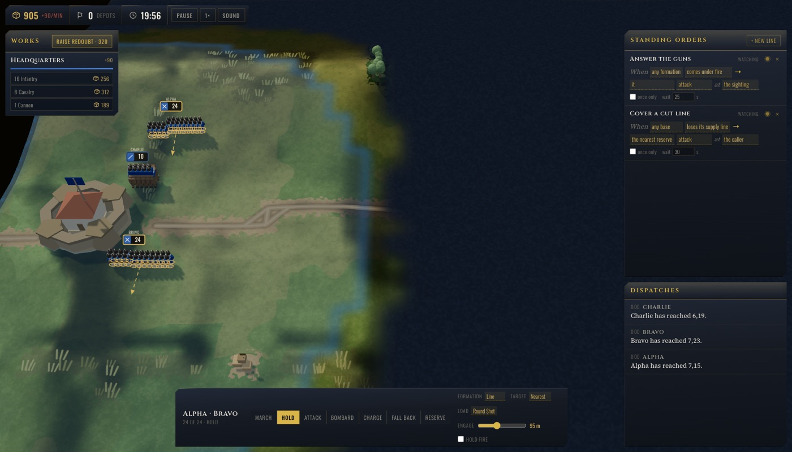
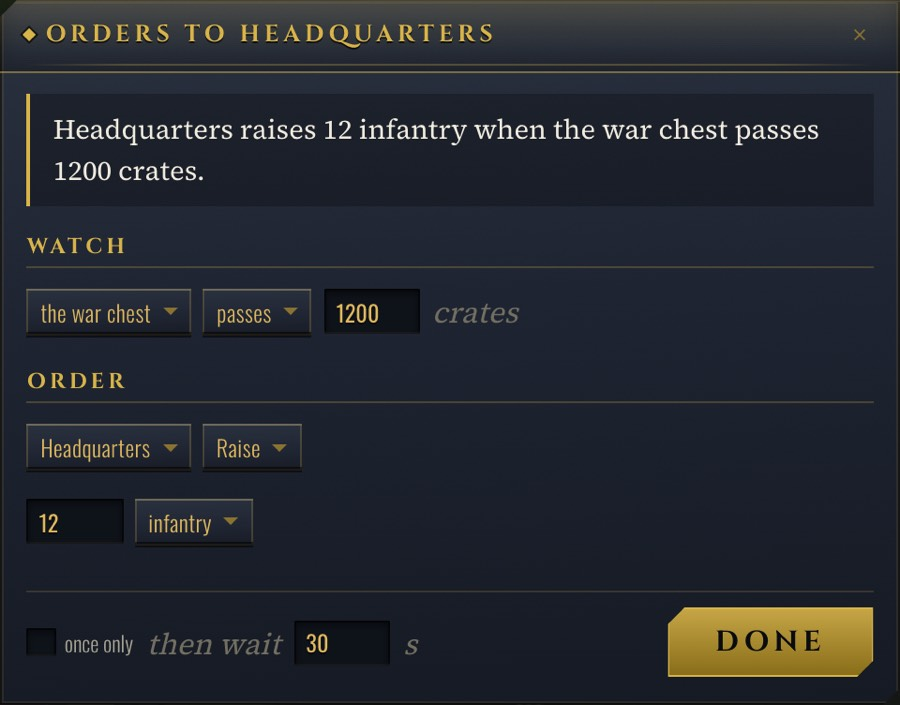

# Overloaded

**A real-time strategy game that doesn't cut its depth down to what one person can watch — because the
second commander is your agent, and it plays through its own surface instead of your screen.**

**[Play it](https://overloaded.fpahmad36.workers.dev)** · 19 WebMCP tools over the live match

Built for the WebMCP Challenge.



## The idea

Every strategy game is trimmed to fit one pair of eyes. Options get folded into submenus, systems
get cut, and what survives is what a person can reach while the clock is running. The ceiling was
never the simulation. It was how much a single player can look at.

A model doesn't have that ceiling. Forty options in a list are no worse for it than four, and a
panel it never has to hunt for is a panel that costs nothing to exist. So the depth can stay, and
the interface doesn't have to be flattened to keep it playable.

Overloaded is built on that. It runs in real time with more going on than you can hold — formations
manoeuvring, supply lines to cut, depots changing hands, guns that have to stop before they fire —
and you play whichever part of it you want. Your agent takes the rest.

## Why WebMCP

Without it, an assistant helping you play has to work off your screen: screenshot the tab, guess
where things are, and take your mouse to act. While it plays, you can't — it is sharing one seat
with you. In a game that never pauses, that isn't help.

`document.modelContext` gives it a seat of its own. The game publishes the match as 19 tools, so the
agent reads the field and gives orders in the same tick you do, from the same state, without a
screenshot and without touching your pointer. Two commanders, one battle, neither waiting on the
other. That is the part that wasn't practical before.

## The game

Napoleonic. You raise infantry, cavalry and artillery, group them into named formations, and fight
over supply depots on a generated map against a clock. Losing your headquarters ends it early.

## Standing orders

Some of the depth is only worth having because something else can manage it. An order is written to
one named formation or one named base, and set off by one named thing:

> **Alpha** attacks **the attacker** when it comes under fire.
>
> **Headquarters** raises **16 infantry** when the war chest passes 1200 crates.

Once written it runs with nobody in the loop: the instant the thing it watches reports, the order
goes out. That is what an agent is actually good for in a game that moves faster than a round trip.
It isn't reacting on your behalf — it is deciding what should happen while nobody is looking.



## The tools

```
overview · inspect_binding · inspect_structure · inspect_cell · inspect_contact
read_alerts · list_rules
recruit · build_work · bind · unbind · rename_binding · issue
add_rule · update_rule · remove_rule
set_match · start_battle · set_paused
```

There is no agent mode and no second copy of the battle. `issue` is the function a right-click
calls, and `add_rule` is the one the **+ NEW** button calls, so an agent's order repaints the panel
it never touched and an order you wrote by hand is one the agent can amend.

They register the standard way, with no adapter:

```js
await document.modelContext.registerTool({
  name: "issue",
  title: "Order a formation",
  description: "Give a named formation its orders now: march, hold, attack, bombard, charge, fall back, reserve.",
  inputSchema: { type: "object", additionalProperties: false, required: ["name", "order"], properties: { /* ... */ } },
  execute: ({ name, ...patch }) =>
    ({ content: [{ type: "text", text: JSON.stringify(issue(match, name, patch)) }] }),
  annotations: { readOnlyHint: false },
});
```

The seven readers carry `readOnlyHint`, every schema is closed so a misspelt key is an error rather
than a silent no-op, and every answer is one envelope with either `data` or a coded `error`. This
works natively in Chrome 152, in Chrome 149+ behind `chrome://flags/#enable-webmcp-testing`, and in
ChatGPT's in-app browser. Where `document.modelContext` is absent the title screen says so and the
game plays normally by hand.

## Stack

TypeScript · Vite 8 · [three.js](https://threejs.org/) · Web Audio API · WebMCP (`webmcp-types`) ·
Cloudflare Workers. No backend, no model API, and no art pipeline: every model is built from
primitives in code, the ground is painted to a canvas at load, and every sound is synthesised.

```bash
npm install
npm run dev
```

```bash
npm run typecheck
npm run lint
npm run build
npm run deploy     # Cloudflare Workers
```

## Licence

MIT — see [`LICENSE`](LICENSE). Third-party notices are in
[`public/licenses/NOTICE.txt`](public/licenses/NOTICE.txt).
